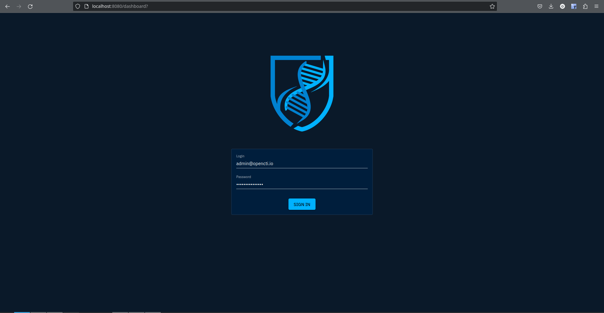
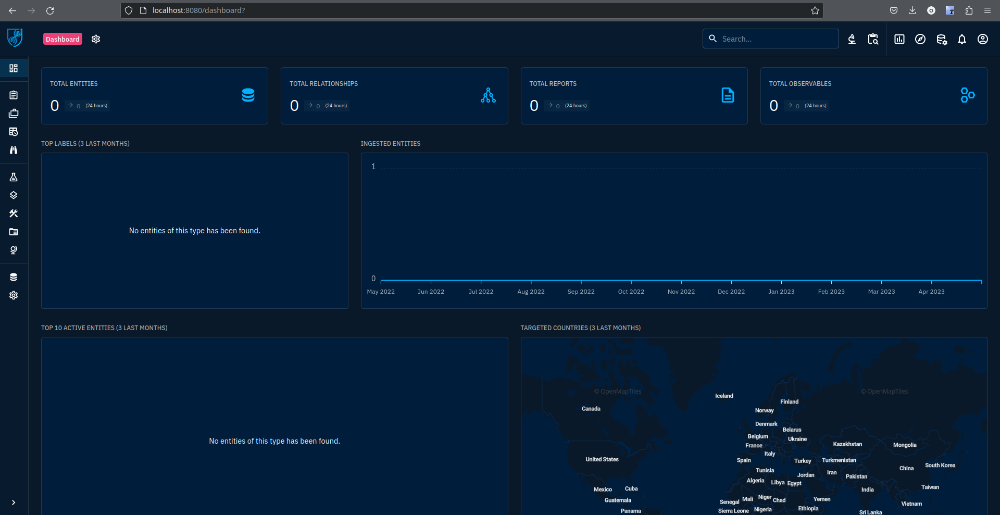
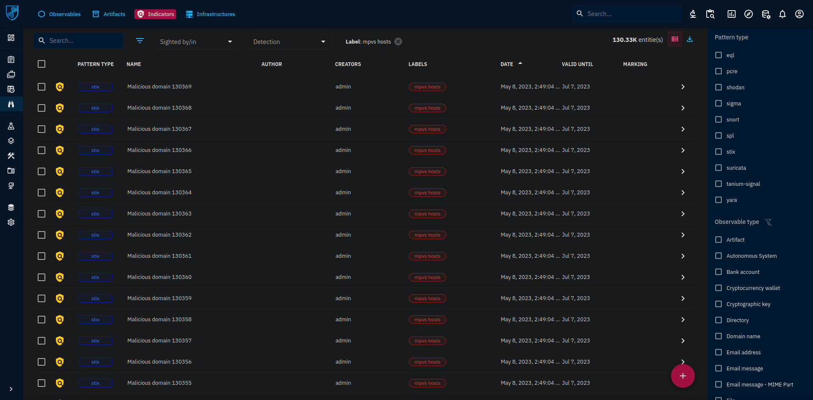
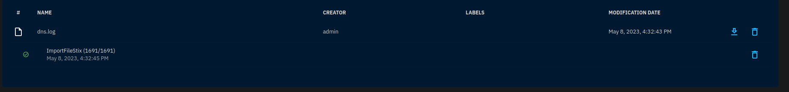
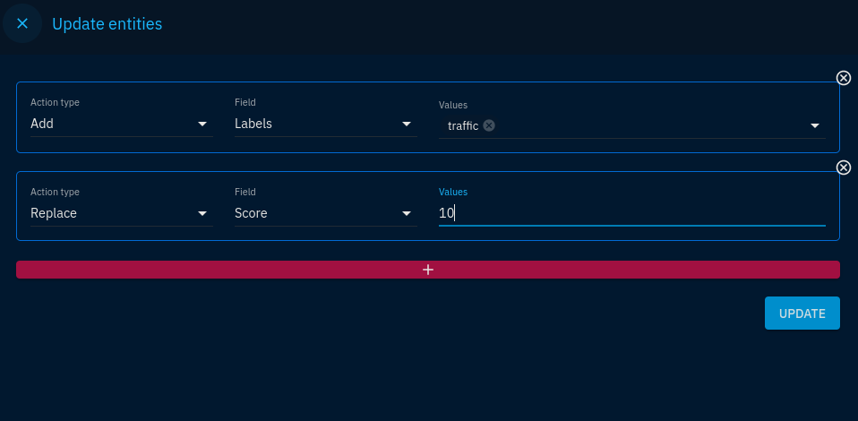
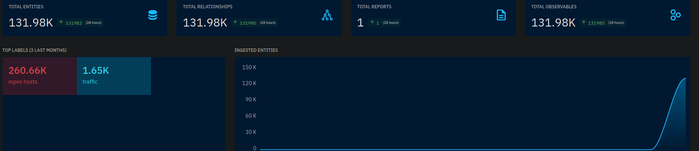
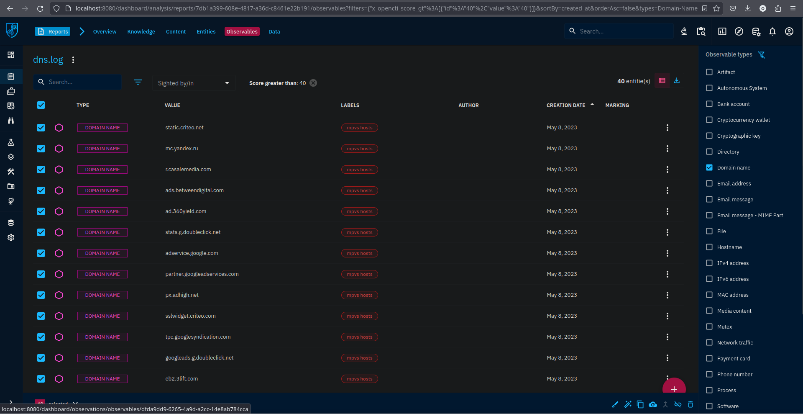

\# Развертывание Threat intelligence Platform OpenCTI

Афанасьев Никита


\## Цель работы


1. Освоить базовые подходы процессов Threat Intelligence


2. Освоить современные инструменты развертывания контейнеризованных

приложений


3. Получить навыки поиска информации об угрозах ИБ


\## Ход выполнения практической работы


Для разворачивания системы threat intelligence OpenCTI была использована

система контейнеризации приложений Docker.


\### Шаг 1 - Предварительная конфигурация


\#### 1.Для работы ElasticSearch требуется увеличить размер виртуальной памяти системы:


\``` bash

sudo sysctl -w vm.max\_map\_count=262144

\```


\### Шаг 2 - создание файла конфигурации


Был создан файл окружения .env со следующими параметрами:


OPENCTI\_ADMIN\_EMAIL - логин администратора

OPENCTI\_ADMIN\_PASSWORD - пароль администратора

OPENCTI\_ADMIN\_TOKEN - токен администратора (UUID4) для API OpenCTI

OPENCTI\_BASE\_URL - доменное имя OpenCTI

MINIO\_ROOT\_USER - логин от minio

MINIO\_ROOT\_PASSWORD - пароль от minio

RABBITMQ\_DEFAULT\_USER - логин от rabbitmq

RABBITMQ\_DEFAULT\_PASS - пароль от rabbitmq

SMTP\_HOSTNAME - хостнейм SMTP

ELASTIC\_MEMORY\_SIZE - размер памяти, используемый ElasticSearch


\#### 3.Создание Docker-compose.yml


Был создан файл Docker-compose.yml, разворачивающий СУБД Redis,

объектное хранилище minio, инстанс ElasticSearch, брокер сообщений

RabbitMQ и систему threat intelligence OpenCTI с коннекторами, вложенный

в репозитории.


\``` bash

docker-compose up -d

\```


lab4\_redis\_1 is up-to-date

lab4\_minio\_1 is up-to-date

lab4\_elasticsearch\_1 is up-to-date

lab4\_rabbitmq\_1 is up-to-date

lab4\_opencti\_1 is up-to-date

lab4\_connector-export-file-txt\_1 is up-to-date

lab4\_connector-export-file-stix\_1 is up-to-date

lab4\_connector-export-file-csv\_1 is up-to-date

lab4\_worker\_1 is up-to-date

lab4\_worker\_2 is up-to-date

lab4\_worker\_3 is up-to-date

lab4\_connector-import-document\_1 is up-to-date

lab4\_connector-import-file-stix\_1 is up-to-date


\#### 4. Использование системы threat intelligence OpenCTI


1. После перехода на веб-ресурс OpenCTI пользователя встречает поле

авторизации:





2. Входим по указанным в конфигурации окружения логину и паролю.


3. После входа появляется веб-интерфейс:





4. Импортируем содержимое файла hosts.txt как индикаторы, используя API

Opencti:


\``` python

import pycti

from stix2 import TLP\_GREEN

from datetime import datetime

date = datetime.today().strftime("%Y-%m-%dT%H:%M:%SZ")


api\_url = 'http://localhost:8080'

api\_token = 'cedd95c3-744d-43ef-a300-2bc54a99baad'

client = pycti.OpenCTIApiClient(api\_url, api\_token)


TLP\_GREEN\_CTI = client.marking\_definition.read(id=TLP\_GREEN["id"])

with open('hosts.txt', 'r') as f:

domains = f.read().splitlines()

k = 1

for domain in domains:

indicator = client.indicator.create(

name="Malicious domain {}".format(k),

description="MPVS hosts",

pattern\_type="stix",

label="mpvs hosts",

pattern="[domain-name:value = '{}']".format(domain),

x\_opencti\_main\_observable\_type="IPv4-Addr",

valid\_from=date,

update=True,

score=75,

markingDefinitions=[TLP\_GREEN\_CTI["id"]],

)

print("Создан индикатор:", indicator["id"])

k += 1

\```


В результате был получен список индикаторов нежелательных доменов с

тегом mpvs hosts:





После импорта индикаторов стоит преобразовать их в Observables для

упрощения анализа.


5. Импортируем трафик, полученный в ходе выполнения ЛР№2 (файл dns.log) в

репозитории:





6. Добавим для всех доменов, которые оказались без тега, тег traffic:





7. В результате главный экран стал выглядеть следующим образом:





8. Проверим, есть ли в полученном трафике (вкладка Report) домены с тегом

нежелательного домена:





Пользователем было посещено 40 нежелательных доменов.


\## Оценка результата


С помощью платформы OpenCTI удалось проанализировать трафик на предмет

перехода по нежелательным доменам.


\## Выводы


Таким образом, были изучены возможности работы с платформой threat

intelligence OpenCTI.
